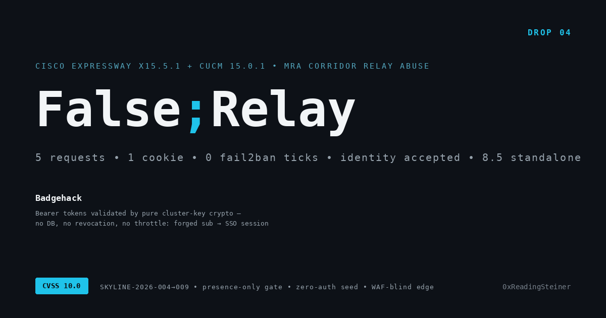

# False;Relay

**Internet-origin pre-auth data access and forged-identity acceptance on Cisco CUCM through the Expressway MRA relay corridor**

One login. One cookie. Five requests. Your DMZ edge is now a proxy into the voice VLAN — and the call manager believes a token nobody issued.

---

## Kill Chain

| Step | Component | Description |
|------|-----------|-------------|
| 1 | **Blankhack** | The internet-facing Expressway-E checks only that the `X-Auth` cookie *exists* — all validation is deferred to the inner box |
| 2 | **Seedhack** | Expressway-C's zero-auth CDB API lets any local process plant a token record — the attacker mints their own relay credential, no MRA account needed |
| 3 | *(corridor)* | Descriptor-prefix routing (`b64url(domain/https/host/port)`) turns the relay into a client-selected proxy to internal CUCM services — proven live to :443 webapps, :8443 UDS (**200 + live XML**), :6970 TFTP-HTTP (**16,889B phone config**) |
| 4 | **Badgehack** | CUCM validates Bearer tokens by pure cluster-key crypto — no DB, no revocation, no lockout, no throttle on success. Keys extractable via published pre-auth RCE (Silent;Call / Dead;Dial). Forged `sub=administrator` token → **`JSESSIONIDSSO` issued from the internet** · `sub`-matched forge → **per-user record read + PIN write (204, DB-verified) from internet origin** (2026-09-28) |
| ★ | **Splithack** | Edge amplifiers: chunk-extension request smuggling (CVE-2026-24033/57834 class) — pre-auth, live-confirmed |
| ★ | **Wraphack** | `Content-Length: 2⁶⁴` int64 wraparound — backend-leg smuggled-request delivery demonstrated live (fix public 11 weeks before this build shipped) |
| ★ | **Namehack** | uint16 header-name truncation (CVE-2026-58155 class) — attacker-chosen values logged as legitimate TAC `TrackingID`s on both boxes |

★ = same-listener amplifiers on E:8443 (WAF-blind smuggling, forensic-correlation poisoning), not required for the corridor itself.

**Proven live from the internet side of the edge — twice, then extended:**
- **Phase A** — seeded relay credential (zero MRA accounts): S1 reachability signature → S2 forged-Bearer acceptance → **200 pre-auth UDS data out of the LAN**
- **Phase B** — production-faithful (one legitimate MRA login, nothing planted): real 8h `X-Auth` → corridor relay → forged Bearer → **`JSESSIONIDSSO` issued**
- **Phase C (2026-09-28)** — the one 401 from the first fires resolved: it was `UDSFilter`'s self-only name-equality rule, not authorization. Sub-matched forged Bearer → **200 full user record + 204 PIN write** (no old PIN, no ownership check), internet-origin, zero real credentials, verified in Informix

Every response on the success path was 2xx/relayed-404: **zero fail2ban ticks, zero bans, zero lockout counters touched.**

## Impact

- **Any phished MRA account** = internet-origin read access to internal CUCM data: UDS service state, phone configuration files (TFTP-HTTP statics), self-care/EM endpoints, PIN-change servlet — quietly, all-2xx.
- **Any pre-auth CUCM RCE** (two published, CVSS 10.0) = cluster key extraction = offline identity forgery for **every user**, permanently, with no throttle and no audit counter — presented through the corridor from the internet.
- **Any process on Expressway-C** = self-minted edge credentials (zero-auth CDB) — the corridor without credentials at all. C ships two local root chains on this release; "any process" is one config bug from "root".
- **The one limit from the first fires is dead (2026-09-28):** the UDS 401 was a self-only name-equality rule with zero role checks behind it — a `sub`-matched forged token reads any user's record and writes its PIN/credentials from the internet, silently, DB-verified. Voicemail push (Unity-stored credentials) remains code-proven only (no Unity server in the lab). We claim exactly what fired.

## Files

| File | Description |
|------|-------------|
| [ADVISORY.md](ADVISORY.md) | Full technical advisory — mechanism, live-fire tables, root-cause, remediation, TLS-verify equivalence statement |
| [poc.sh](poc.sh) | Non-destructive PoC (credential tier): login → corridor probe → S1/S2 differential. GET-only, ≥3s pacing, secrets hashed, forging NOT included |
| [mitigations.md](mitigations.md) | Suricata/Snort detection rules + CUCM/Expressway log-side detection + hardening checklist + what does NOT work |

## Quick Test

```bash
./poc.sh --edge edge.example.com:8443 --domain example.com \
         --target cucm01.internal.example.com --port 8443 --user MRAUSER
```

If step [2] returns `HTTP 200` with `version="15.0.1"` XML — your relay is answering internet-origin requests with internal CUCM data. If you supply `--bearer` and step [4] shows `JSESSIONIDSSO issued` — CUCM accepted a forged identity through the corridor.

---

**Affected:** Cisco Expressway-E/C X15.5.1 (ATS 9.2.11 rebuild, 2026-05-08) · Cisco Unified Communications Manager 15.0.1.12900-234
**Chain CVSS:** 10.0 composed (zero credentials, via published RCE drops — re-rated 2026-09-28 after the sub-matched-forge live proof moved integrity L→H) · 8.5 standalone (one MRA account)
**Vendor status:** Cisco PSIRT unresponsive since 2026-08-04. Fourth drop published without acknowledgment.

0xReadingSteiner — 0xReadingSteiner@proton.me — PGP D5E22255F645A8B935056C278C0958C5D533080A
